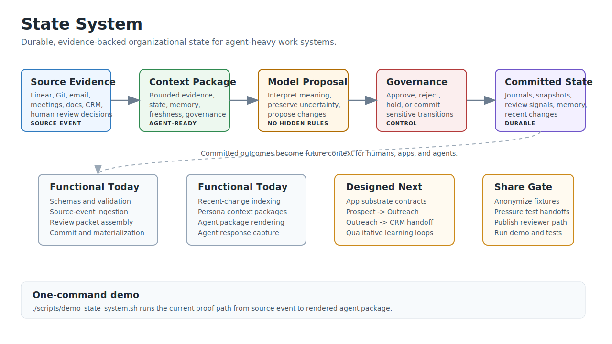

# State System

State System is a generic model-mediated substrate for tracking organizational
state.

It defines how organizations, missions, strategies, roles, onboarding, projects,
deals, relationships, campaigns, meetings, obligations, people, and agents
maintain durable state over time. The first use case is work and organizational
operations, not PAIA migration. PAIA remains a useful reference, but this repo
owns its own design and can grow into runtime plumbing.

## Core Idea

State is not a note, a prompt, or a transient model context dump.

State is a durable, scoped record of:

- what appears to be true now
- why that view changed
- what evidence supports it
- what is uncertain
- what needs attention
- what actions have been proposed or taken

The model interprets meaning and proposes state transitions. Code validates
schemas, evidence, access policy, persistence, audit, and runtime execution.

## System Shape



For a richer local orientation diagram, open `docs/system-diagram.html` in a
browser.

## Reviewer Path

If you are reviewing State System for the first time, read it in this order:

1. This README for the thesis, current runtime, and limits.
2. `docs/system-diagram.html` for the broader architecture map.
3. `docs/NORTH_STAR.md` for the intended direction.
4. `docs/concepts/first-deployment-implementation-blueprint.md` for the
   implemented runtime path.
5. One runnable trace in `examples/traces/`, starting with
   `examples/traces/linear-deal-won.trace.json`.
6. `docs/app-substrate-contract.md` and
   `docs/app-integration-pressure-tests.md` for the app-facing future state.

Good feedback targets:

- whether the source event, context package, model proposal, governance, and
  commit boundaries are the right boundaries
- where the model-mediated layer is too vague, too powerful, or not powerful
  enough
- what failure modes are missing around stale context, hidden heuristics,
  approval bypasses, and app-local state drift
- what would make this useful in another agent-heavy workflow

## What Works Today

The current repo is a working contract prototype, not only a reference design.
It can run a local JSON-backed runtime loop that:

- validates schemas and examples
- validates trace manifests
- ingests a source event with idempotency checks
- builds a model review packet from source evidence, state, persona, and
  governance context
- commits a fixture model proposal into journals, state snapshots, review
  signals, and rollup requests
- indexes recent changes for persona-specific routing
- builds and renders agent-readable context packages
- creates persisted agent activation records with goals, expected response
  types, allowed/prohibited actions, evidence refs, freshness, and capture
  policy
- renders activation records into agent-facing instructions plus the bounded
  context package
- captures raw agent responses with package and evidence refs
- writes a static user-test report at `index.html` for each trace run
- seeds company capability packs into a runtime state root and emits a
  PAIA-facing company capability read model from persisted runtime records

The main functional surface is now a trace runner. A trace manifest declares the
source evidence, seed state, model proposal fixture, governance context, recent
change routing, context package, agent activation, rendered activation, and
captured response. The runner executes the flow and writes a machine-readable
report, a user-readable HTML report, and each intermediate artifact.

Canonical traces:

- `examples/traces/linear-deal-won.trace.json` proves accepted state update,
  materialized state, recent-change routing, context packaging, and agent
  response capture.
- `examples/traces/laura-approval-gated-publication.trace.json` proves
  governance can hold an external-facing action as pending approval without
  materializing state or executing the action.
- `examples/traces/laura-agent-activation.trace.json` proves an agent can be
  activated from a bounded context package, receive explicit action boundaries,
  and have its response captured without treating that response as truth.
- `examples/traces/laura-stale-context-refresh.trace.json` proves a stale
  package surfaces its validity window, refresh requirement, prohibited external
  action, and captured refusal to proceed externally before refresh.
- `examples/app-integrations/` now includes schema-valid contract fixture
  chains for Prospect Researcher -> Outreach Engine and Outreach reply -> CRM
  plus secondary contact and engagement-intelligence artifacts.

Run the operational loop:

```bash
./scripts/run_operational_loop.sh
```

This is the current "basics working" path. It runs source/evidence -> review
packet -> model proposal fixture -> commit -> recent-change index -> context
package -> agent activation -> captured response, then writes
`operator-summary.json` plus the trace artifacts. The captured response remains
an artifact and does not become truth by default.

Run the one-command demo:

```bash
./scripts/demo_state_system.sh
```

The demo writes the full report suite to a temporary directory and prints that
path at the end. It also prints the static report-suite path:

```text
Report Suite: /tmp/state-system-demo.XXXXXX/index.html
```

Run the current report suite:

```bash
python3 -m state_system.cli --project-root . report-suite-run --output-dir /tmp/state-system-report-suite
```

Open `/tmp/state-system-report-suite/index.html` to inspect the current
agent-activation trace report, app-integration contract report, and mission
records HTML report from one place. The mission report also links to the raw
`mission-read-model.json` artifact for machine inspection.

Replay the deterministic mission fixture and regenerate its read model:

```bash
python3 -m state_system.cli --project-root . mission-replay examples/missions/repo-audit-streamlinear.json --output-dir /tmp/state-system-mission
```

The mission replay writes `/tmp/state-system-mission/mission-read-model.json`
plus the file-backed mission records used to generate it.

Build the company memory and CRM operating picture substrate read model:

```bash
python3 -m state_system.cli --project-root . company-memory-build examples/company-memory/lfw-company-memory.json examples/company-memory/lfw-crm-operating-picture.json --output-dir /tmp/state-system-company-memory
```

This writes `/tmp/state-system-company-memory/company-memory-read-model.json`.
The artifact is JSON substrate; any HTML/wiki/dashboard surface should be a
projection over it.

Seed the runtime company capability records that PAIA should target before local
connector/tool wiring:

```bash
python3 -m state_system.cli --project-root . --state-root /path/to/runtime company-capability-seed examples/company-capability/company-lfw.json examples/company-capability/company-synthyra.json examples/company-capability/company-navicyte.json
python3 -m state_system.cli --project-root . --state-root /path/to/runtime company-capability-read --output-dir /tmp/state-system-company-capability
```

This writes
`/tmp/state-system-company-capability/company-capability-read-model.json`.
`CompanyCapabilityPack` declares and packages company capability context. It
does not prove live access and does not authorize execution. PAIA preflight
proves live access; governance authorizes protected action. PAIA should expose
tools from `companies[].tool_capability_bindings[]` and resolve preflight
targets from `companies[].source_connectors[]`, not by interpreting connector
names or free-text descriptions.
For `connector_type: gws_drive`, `source_ref` uses
`gws:<gws-account-profile>:<drive|shared-drive>:<lookup-key>`.
For `connector_type: msgvault`, `source_ref` remains
`msgvault:tenant:<tenant-id>` and live preflight uses
`source_connectors[].preflight_target`, not a query inferred from the tenant id.

Record and export PAIA-owned connector preflight results as live-access
evidence:

```bash
python3 -m state_system.cli --project-root . paia-bootstrap-export
python3 -m state_system.cli --project-root . --state-root /Users/braydon/.paia/state-system company-preflight-record --preflight-ref preflight.lfw.linear --company-ref company.lfw --connector-ref connector.lfw.linear --tool-ref tool.paia.linear.read --action-ref action_surface.lfw.read_linear --agent-ref persona.caroline --runner-ref runner.paia.codex --status passed --checked-at 2026-05-14T18:20:00Z --stale-after 2026-05-14T19:20:00Z --evidence-ref paia:preflight:linear:20260514T182000Z
python3 -m state_system.cli --project-root . --state-root /Users/braydon/.paia/state-system company-preflight-export --output-dir /Users/braydon/.paia/state-system/company-preflight
```

Record and export PAIA-owned source freshness heartbeat results as recency
evidence:

```bash
python3 -m state_system.cli --project-root . --state-root /Users/braydon/.paia/state-system source-freshness-record --company-ref company.lfw --connector-ref connector.lfw.linear --source-ref linear:teams:FORGE,INT --connector-type linear --status fresh --checked-at 2026-05-15T12:00:00Z --source-watermark linear.latest_updated_at:2026-05-15T11:58:00Z --stale-after 2026-05-15T12:15:00Z --lag-seconds 120 --evidence-ref paia:freshness:linear:company.lfw:20260515T120000Z
python3 -m state_system.cli --project-root . --state-root /Users/braydon/.paia/state-system source-freshness-export --output-dir /Users/braydon/.paia/state-system/source-freshness
```

Run the active State System heartbeat. In v0 it directly checks `local_path`
connector metadata and records explicit `unknown` freshness for credentialed
connectors that still require delegated adapters:

```bash
python3 -m state_system.cli --project-root . --state-root /Users/braydon/.paia/state-system source-heartbeat-run --company-ref company.lfw --checked-at 2026-05-15T13:00:00Z --stale-after 2026-05-15T13:15:00Z --output-dir /Users/braydon/.paia/state-system/source-freshness
```

The bootstrap command refreshes the expected PAIA artifact layout under
`/Users/braydon/.paia/state-system`. It writes
`/Users/braydon/.paia/state-system/company-capability/company-capability-read-model.json`
and
`/Users/braydon/.paia/state-system/company-preflight/company-preflight-results-read-model.json`
and
`/Users/braydon/.paia/state-system/source-freshness/source-freshness-read-model.json`.
Preflight results prove or fail live access only. They do not authorize
protected effects; governance remains separate.
Freshness results prove source recency only. They do not prove live access and
do not authorize protected effects.

## What Is Designed Next

The current operational priority is to run and harden the boring local loop
before adding more substrate concepts. The intended next functional slices are:

- PAIA should wrap company capability packs into runtime packets only after
  connector preflight proves live access and governance is checked for protected
  action.
- Run the operational loop against one or two real local sources through manual
  source-event fixtures before wiring live adapters.
- Improve the operator summary until it is useful enough to inspect after every
  run.
- Only then define `ObjectRecord` and `ClaimRecord` as the lower substrate under
  working models, state objects, packets, and projections.
- Extend company memory and CRM operating picture fixtures with more source
  recipes, relationship states, opportunities, open loops, and freshness rules.
- Promote more app-substrate scenarios into runnable traces when they expose new
  state, memory, approval, or doctrine behavior.
- Keep packets, wiki, dashboard, and report surfaces as working models or
  projections over substrate.
- Qualitative human judgment remains model-interpretable evidence, not hidden
  numeric scoring or hardcoded rules.

Before sharing externally, real-looking fixture names and source refs should be
anonymized.

## Initial Contents

- `docs/NORTH_STAR.md` - guiding North Star for the effort
- `docs/system-diagram.html` - standalone HTML/SVG orientation diagram with completeness key and workflow explainer
- `docs/app-substrate-contract.md` - app-facing contract for shared state, proposals, evidence, and approval flows across the new application repos
- `docs/app-integration-pressure-tests.md` - cross-app pressure tests for handoffs, approval gates, qualitative learning, and hidden heuristic drift
- `docs/specs/2026-04-28-state-system-design.md` - initial system design
- `docs/specs/2026-04-28-state-system-speedrift-plan.md` - Speedrift execution anchor for the first deployment
- `docs/concepts/` - focused concept notes
- `docs/concepts/end-state-architecture.md` - target architecture and reusable PAIA assets
- `docs/concepts/agent-memory.md` - individual agent memory and promotion to shared state
- `docs/concepts/working-models.md` - generic working-model abstraction over durable substrate, including PAIA packets and State System context/read-model shapes
- `docs/concepts/paia-memory-adapter-boundary.md` - adapter boundary for reusing PAIA memory without making State System PAIA-only
- `docs/concepts/deep-reviewer-personas.md` - how antagonistic reviewer personas such as Miriam are used through Workgraph/Speedrift
- `docs/concepts/runtime-v0.md` - first practical local runtime loop from source event to persona package
- `docs/concepts/ontology.md` - first-cut organizational state ontology
- `docs/concepts/lfw-ontology-pressure-test.md` - concrete LFW example used to test the ontology
- `docs/concepts/state-update-lifecycle.md` - trigger-to-journal-to-snapshot lifecycle
- `docs/concepts/first-deployment-mode.md` - first deployment mode for the end-state architecture
- `docs/concepts/model-pressure-test.md` - scenario pressure test for the model-mediated decision layer
- `docs/concepts/model-reviewer-runtime-boundary.md` - production reviewer prompt, tool, and agent access boundary
- `docs/concepts/committer-and-governance.md` - how proposals become durable effects or pending/rejected signals
- `docs/concepts/governance-policy.md` - inspectable policy shape for approvals and blocked effects
- `docs/concepts/first-deployment-implementation-blueprint.md` - implementation path and fixture trace for the first deployment
- `docs/concepts/materialization-and-patch-semantics.md` - how accepted journal patches become snapshots
- `docs/concepts/patrick-ops-manager.md` - second persona and operational pressure test
- `docs/concepts/workgraph-speedrift-github-integration.md` - how State System attaches to execution, drift, and code collaboration systems
- `docs/concepts/model-mediation-drift-memory-loop.md` - how Speedrift model-agency findings become source events, review packets, memory, state, or Workgraph action proposals
- `docs/concepts/recent-change-registry-and-agent-opportunities.md` - recent-change indexing and persona-specific opportunity review
- `docs/concepts/agent-context-packages.md` - bounded persona-specific context packages for agents
- `docs/concepts/system-pressure-test.md` - system-level pressure test across routing, packaging, freshness, governance, and agent conflict
- `docs/concepts/routing-audit-and-freshness.md` - routing audit, excluded context, and package freshness rules
- `docs/concepts/catch-points.md` - where facts, meaning, routing, packages, opportunity, risk, and rollups are caught
- `docs/concepts/source-events-and-idempotency.md` - source event envelope, idempotency keys, sync context, and source watermarks
- `docs/concepts/backward-gap-audit.md` - thin backward pass before committer implementation
- `docs/concepts/speedrift-execution-lane.md` - Workgraph/Speedrift implementation lane and pressure-test gates
- `schemas/` - draft JSON schemas for source events, state objects, journals, triggers, model review packets, model outputs, commit results, review signals, memory entries, governance policies, personas, facets, recent-change entries, context packages, agent activations, company capability packs, and agent responses
- `examples/` - example state packets and end-to-end traces for Laura and Patrick, including GitHub commitment fixtures
- `examples/company-capability/` - LFW, Synthyra, and Navicyte company capability packs for PAIA coordination
- `examples/traces/` - runnable trace manifests for replaying source-event-to-agent-context flows
- `examples/app-integrations/` - app integration fixture trace anchors for Prospect Researcher, Outreach Engine, CRM, Meeting Manager, Thoughtforge, and Visual Forge

## First Personas

Laura is the first modeled persona: a marketing agent focused on positioning,
campaign momentum, audience fit, narrative clarity, and commercially grounded
creative judgment.

Laura is not a PAIA personal assistant. She is a work agent whose personality
is expressed through professional judgment facets. She is also a test case for
how persona-mediated interpretation can maintain broader organizational state,
such as marketing narrative and mission alignment.

Patrick is the second modeled persona: an operations manager agent focused on
source-of-truth discipline, stale-state detection, ownership clarity,
follow-through, and governance boundaries around contracts and commitments.

Patrick gives the system a comparison trace. Where Laura tests strategic and
market-facing interpretation, Patrick tests terse operational state: what is the
owner, what is the stage, what is missing, what is the next action, and what
requires human approval before external action.

Miriam is the first deep reviewer persona: an antagonistic critical reviewer and
systems epistemologist focused on source/evidence boundaries, category errors,
coherence failure, governance leaks, activation-to-use confusion, and downstream
effects that could make the system confidently wrong.

## Validation

Run the shareable functional demo:

```bash
./scripts/demo_state_system.sh
```

Run the canonical trace directly:

```bash
python3 -m state_system.cli --project-root . trace-run examples/traces/linear-deal-won.trace.json --output-dir /tmp/state-system-trace
python3 -m state_system.cli --project-root . trace-run examples/traces/laura-approval-gated-publication.trace.json --output-dir /tmp/state-system-approval-trace
python3 -m state_system.cli --project-root . trace-run examples/traces/laura-agent-activation.trace.json --output-dir /tmp/state-system-agent-activation
python3 -m state_system.cli --project-root . trace-run examples/traces/laura-stale-context-refresh.trace.json --output-dir /tmp/state-system-stale-refresh
```

Run the app-integration contract report:

```bash
python3 -m state_system.cli --project-root . app-integrations-run --output-dir /tmp/state-system-app-integrations
```

The app-integration report writes `app-integration-report.json` and
`index.html`. It currently checks the Prospect Researcher -> Outreach Engine
handoff and the Outreach reply -> CRM plus secondary contacts handoff.

Run the local contract and fixture harness:

```bash
python3 -m unittest tests/test_contracts.py tests/test_stores.py tests/test_source_events.py tests/test_runner_reviewer.py tests/test_committer_materializer.py tests/test_governance_pressure.py tests/test_recent_context_packaging.py tests/test_cli.py tests/test_e2e_pressure_harness.py tests/test_cli_runtime.py tests/test_git_source_adapter.py tests/test_live_git_runtime.py tests/test_agent_consumers.py tests/test_trace_runner.py tests/test_agent_activation.py tests/test_trace_reporting.py tests/test_app_integration_contracts.py tests/test_app_integration_runner.py tests/test_mission_records.py tests/test_mission_replay.py tests/test_company_capability_pack.py tests/test_company_capability_runtime.py tests/test_company_preflight_results.py tests/test_source_freshness.py tests/test_active_heartbeat.py tests/test_paia_bootstrap_export.py
```

## Runtime V0 CLI

The first local runtime loop is exposed as JSON CLI commands:

```bash
python3 -m state_system.cli --project-root . validate
python3 -m state_system.cli --project-root . trace-run examples/traces/linear-deal-won.trace.json --output-dir /tmp/state-system-trace
python3 -m state_system.cli --project-root . trace-run examples/traces/laura-approval-gated-publication.trace.json --output-dir /tmp/state-system-approval-trace
python3 -m state_system.cli --project-root . trace-run examples/traces/laura-agent-activation.trace.json --output-dir /tmp/state-system-agent-activation
python3 -m state_system.cli --state-root /path/to/runtime seed-runtime --repo-ref repo.state-system --created-at 2026-05-01T18:45:00Z
python3 -m state_system.cli --project-root . --state-root /path/to/runtime paia-bootstrap-export
python3 -m state_system.cli --project-root . --state-root /path/to/runtime company-capability-seed examples/company-capability/company-lfw.json examples/company-capability/company-synthyra.json examples/company-capability/company-navicyte.json
python3 -m state_system.cli --project-root . --state-root /path/to/runtime company-capability-read --output-dir /tmp/state-system-company-capability
python3 -m state_system.cli --project-root . --state-root /path/to/runtime company-preflight-record --preflight-ref preflight.lfw.linear --company-ref company.lfw --connector-ref connector.lfw.linear --tool-ref tool.paia.linear.read --action-ref action_surface.lfw.read_linear --agent-ref persona.caroline --runner-ref runner.paia.codex --status passed --checked-at 2026-05-14T18:20:00Z --stale-after 2026-05-14T19:20:00Z --evidence-ref paia:preflight:linear:20260514T182000Z
python3 -m state_system.cli --project-root . --state-root /path/to/runtime company-preflight-export --output-dir /tmp/state-system-company-preflight
python3 -m state_system.cli --project-root . --state-root /path/to/runtime source-freshness-record --company-ref company.lfw --connector-ref connector.lfw.linear --source-ref linear:teams:FORGE,INT --connector-type linear --status fresh --checked-at 2026-05-15T12:00:00Z --source-watermark linear.latest_updated_at:2026-05-15T11:58:00Z --stale-after 2026-05-15T12:15:00Z --lag-seconds 120 --evidence-ref paia:freshness:linear:company.lfw:20260515T120000Z
python3 -m state_system.cli --project-root . --state-root /path/to/runtime source-freshness-export --output-dir /tmp/state-system-source-freshness
python3 -m state_system.cli --state-root /path/to/runtime trigger examples/source-linear-southern-abrasives-won.json
python3 -m state_system.cli --state-root /path/to/runtime git-commit-event /path/to/commit.json --repo-ref repo.state-system --observed-at 2026-05-01T18:01:00Z --candidate-state-ref state.repo.state-system.runtime --ingest
python3 -m state_system.cli --state-root /path/to/runtime git-commit-from-repo . --commit HEAD --repo-ref repo.state-system --observed-at 2026-05-01T18:46:00Z --candidate-state-ref state.repo.state-system.runtime --ingest
python3 -m state_system.cli --state-root /path/to/runtime index-source-recent source.git.repo.state-system.<sha> --created-at 2026-05-01T18:47:00Z --summary "Latest commit changed runtime support." --routes /path/to/routes.json --watermark-ref git:repo.state-system:commit:<sha> --stale-after 2026-05-02T18:47:00Z
python3 -m state_system.cli --state-root /path/to/runtime review source.linear.southern-abrasives-won --packet-id review_packet.linear.southern-abrasives-won --created-at 2026-04-28T16:05:30Z --persona examples/patrick-persona.json --resolved-evidence /path/to/evidence.json --governance-constraints /path/to/governance.json
python3 -m state_system.cli --state-root /path/to/runtime commit examples/linear-southern-abrasives-won-model-proposal-output.json --created-at 2026-04-28T16:07:00Z --evidence-ref linear:deal:southern-abrasives
```

## Agent Activation Contract V0

Humans operate through agents in this design. A reporting surface may exist, but
the primary use path is: State System creates an activation record, an agent
acts from that bounded context, and the response is captured as evidence for the
next review loop.

Create and render an activation:

```bash
python3 -m state_system.cli --state-root /path/to/runtime activate-agent context.laura.southern-abrasives-won-opportunity --consumer consumer.codex --created-at 2026-05-03T10:00:00Z --activation-goal "Draft internal material and identify what requires approval." --expected-response-type proposal
python3 -m state_system.cli --state-root /path/to/runtime render-activation activation.context.laura.southern-abrasives-won-opportunity.consumer.codex.20260503T100000Z
```

Context packages can still be rendered directly for inspection or debugging:

```bash
python3 -m state_system.cli --state-root /path/to/runtime render-package context.laura.southern-abrasives-won-opportunity
```

Raw agent output is captured as a durable artifact linked back to the package
and evidence that shaped it:

```bash
python3 -m state_system.cli --state-root /path/to/runtime capture-response context.laura.southern-abrasives-won-opportunity /path/to/response.txt --consumer consumer.codex --created-at 2026-05-03T10:02:00Z --activation-id activation.context.laura.southern-abrasives-won-opportunity.consumer.codex.20260503T100000Z
```
